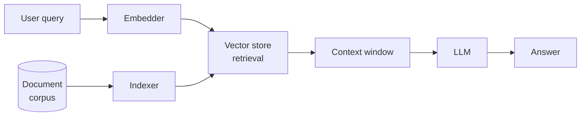

# Hello — first post

Welcome to my little corner of the internet. I'll be writing here about data systems, ML, and LLMs — the things I spend most of my time thinking about.

## What to expect

Posts will be technical but won't assume you've read everything I've read. My goal is to write the article I wish existed when I was learning the thing.

A few topics I plan to cover:

- **Unstructured data at scale** — how you actually move and index it, not just in theory
- **LLM architecture internals** — attention, KV cache, quantisation, and what matters in practice
- **Fine-tuning** — LoRA, Unsloth, and getting real results on consumer hardware

## A sample diagram

Here's a simplified view of a RAG pipeline, the kind of thing I work with regularly:

---

More soon. If something here is wrong or you want to push back on it, my email is at the bottom of the page.
