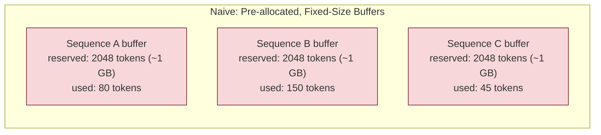
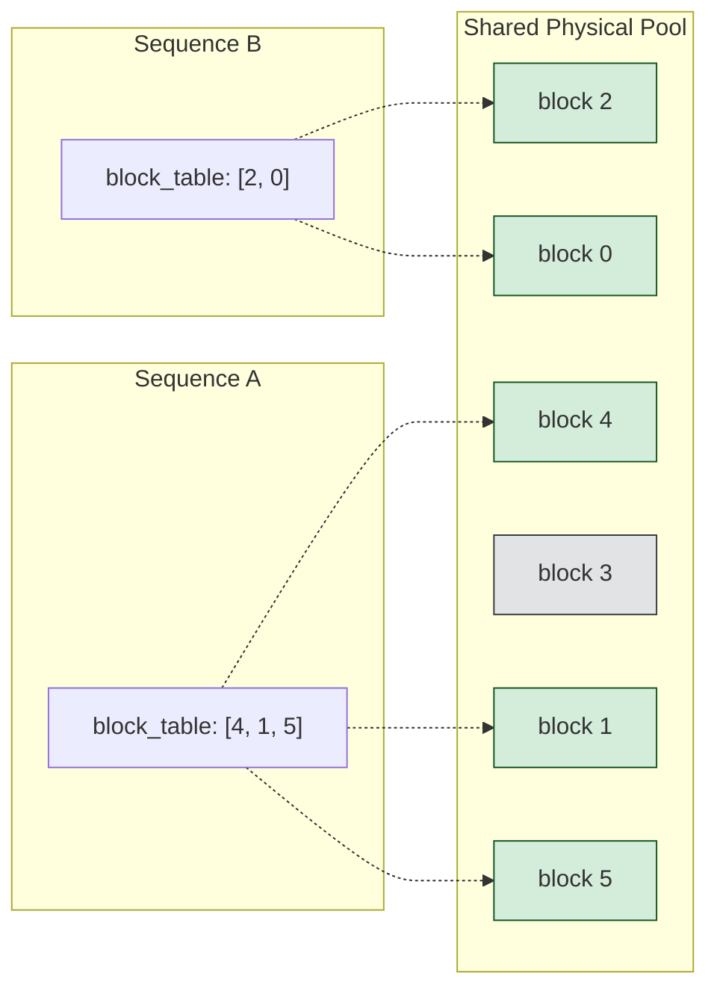
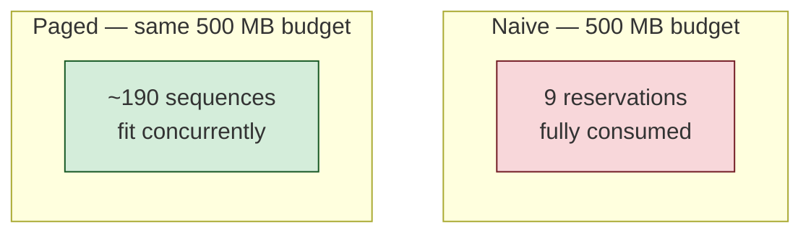

# Implementing Paged KV Cache: A From-Scratch Walkthrough

## Why KV Caching Exists

Autoregressive decoding generates one token at a time, and at every step, attention needs the key (K) and value (V) vectors of every preceding token. The naive approach recomputes K and V for the entire prefix at each step — wasteful, because a past token's K and V never change once computed; they depend only on that token's (already-finalized) hidden state, not on what comes after it.

The fix is the standard KV cache: compute K and V for each token once, store them, and reuse them on every subsequent step.

> This turns an O(n²) recomputation pattern into O(n) incremental work.

```
step 1: predict "the"   -> needs K,V for: []
step 2: predict "cat"   -> needs K,V for: [the]
step 3: predict "sat"   -> needs K,V for: [the, cat]
step 4: predict "down"  -> needs K,V for: [the, cat, sat]
```

Each step appends one new K,V pair and reuses everything previously cached.

## The Naive Implementation and Its Failure Mode

The straightforward implementation pre-allocates one contiguous tensor per sequence, sized for the model's maximum context length:

```python
cache_k = np.zeros((MAX_LEN, n_kv_heads, head_dim), dtype=np.float16)
cache_v = np.zeros((MAX_LEN, n_kv_heads, head_dim), dtype=np.float16)
```

Contiguity is required for the GPU's memory-coalescing pattern — a flat block of numbers with predictable strides lets the hardware fetch and compute efficiently. But a contiguous tensor can't grow cheaply. The only options are to reserve for the worst case up front, or reallocate-and-copy as the sequence grows. Production engines reserve for the worst case, since reallocation is unacceptable on the hot path.

This is where the naive scheme breaks down. Take a representative 7B-class model: 32 layers, d_model 4096, fp16. Each token's KV footprint across all layers is:

```
2 (K and V) × 32 layers × 4096 dim × 2 bytes ≈ 512 KB/token
```

At a 2048-token max context, that's roughly 1 GB reserved per sequence — regardless of whether the conversation is 10 tokens or 2000. Real traffic is dominated by short sequences (averaging a few hundred tokens in most chat workloads), so the reservation is mostly empty space that cannot be reclaimed or shared.



On a fixed memory budget, this caps concurrency hard. A GPU with 10 GB available for KV cache holds only ~9 such reservations — independent of how short those conversations actually are. Utilization sits around 10%, and the other 90% is reserved-but-idle memory blocking new requests.

## Paging: Decoupling Logical Sequence from Physical Memory

The fix mirrors OS virtual memory. Instead of one contiguous buffer per sequence, the cache is divided into fixed-size **blocks** (analogous to pages), held in a single shared **pool** (physical memory) with a **free list** tracking availability. Each sequence holds a **block table** — an ordered list of physical block IDs — that maps its logical token positions to wherever those tokens actually live in the pool.



Note that sequence A's blocks (`4, 1, 5`) are non-adjacent in the pool, and sequence B's blocks are interleaved with A's.

> Neither sequence's data is contiguous as a whole — but each block individually is contiguous, which is the only granularity the GPU's coalesced-read requirement actually needs.

### Implementation

```python
class PagedKVCache:
    def __init__(self, num_blocks, block_size, n_kv_heads, head_dim, dtype=np.float16):
        self.block_size = block_size
        self.n_kv_heads = n_kv_heads
        self.head_dim = head_dim
        # One shared pool: [num_blocks, block_size, n_kv_heads, head_dim]
        self.k_pool = np.zeros((num_blocks, block_size, n_kv_heads, head_dim), dtype=dtype)
        self.v_pool = np.zeros((num_blocks, block_size, n_kv_heads, head_dim), dtype=dtype)
        self.free_blocks = list(range(num_blocks))
        self.block_tables = {}   # seq_id -> [physical_block_id, ...]
        self.seq_lengths = {}    # seq_id -> token count

    def add_sequence(self, seq_id):
        self.block_tables[seq_id] = []
        self.seq_lengths[seq_id] = 0

    def append(self, seq_id, k, v):
        length = self.seq_lengths[seq_id]
        block_in_seq, offset = divmod(length, self.block_size)
        if offset == 0:                              # crossed a block boundary
            self.block_tables[seq_id].append(self.free_blocks.pop())
        phys = self.block_tables[seq_id][block_in_seq]
        self.k_pool[phys, offset] = k
        self.v_pool[phys, offset] = v
        self.seq_lengths[seq_id] = length + 1

    def gather(self, seq_id):
        length = self.seq_lengths[seq_id]
        blocks = self.block_tables[seq_id]
        k = self.k_pool[blocks].reshape(-1, self.n_kv_heads, self.head_dim)[:length]
        v = self.v_pool[blocks].reshape(-1, self.n_kv_heads, self.head_dim)[:length]
        return k, v

    def free(self, seq_id):
        self.free_blocks.extend(self.block_tables.pop(seq_id))
        del self.seq_lengths[seq_id]
```

Three operations carry the whole design:

**`append`** computes the logical block and in-block offset via `divmod(length, block_size)`. A block is only pulled from the free list when `offset == 0` — i.e., the previous block just filled up. This is the page-fault equivalent: allocation happens lazily, exactly when needed, never speculatively.

**`gather`** reassembles the logical view attention expects. `k_pool[blocks]` performs fancy indexing in block-table order, pulling physically scattered blocks into a temporary contiguous array shaped `(n_blocks, block_size, n_kv_heads, head_dim)`. The reshape flattens the block and slot dimensions into a single token axis, and the final slice trims any unused tail capacity in the last block. Because attention over keys/values is a sum over independent per-token terms, this block-by-block reconstruction is mathematically identical to attending over a truly contiguous buffer — verified directly: contiguous and paged attention outputs match to floating-point precision regardless of how scrambled the physical block placement is.

**`free`** returns a sequence's blocks to the shared list, making them immediately available to the next sequence — no compaction or copying needed.

### A note on attention heads and cache shape

The pool shape `[num_blocks, block_size, n_kv_heads, head_dim]` reflects multi-head attention directly. Each head learns an independent attention pattern over its own Q/K/V subspace; this is what lets the model attend to multiple distinct relationships (e.g., subject-verb agreement and recent-token locality) simultaneously rather than averaging them into one diluted signal. Splitting `d_model` into `n_heads × head_dim` is purely a reshape — no data movement, just a different way of indexing the same numbers, which is why each cached token's entry is naturally `(n_heads, head_dim)` rather than a flat vector.

For models using grouped-query attention (GQA) — Llama 3.2 1B included — the number of *KV* heads is smaller than the number of *query* heads (8 vs. 32 in this case, with groups of 4 query heads sharing one KV head). This directly shrinks the cache: KV storage scales with `n_kv_heads`, not `n_heads`, which is precisely why GQA exists as a cache-size optimization.

## Quantifying the Improvement

Using Llama 3.2 1B's real dimensions (16 layers, 8 KV heads, head_dim 64, fp16) and a 500 MB KV budget:

| Scheme | Allocation strategy | Users served | Utilization |
|---|---|---|---|
| Naive | Reserve 512 tokens/user up front | ~30 | ~16% (avg. 80-token conversations) |
| Paged | Allocate 16-token blocks on demand | ~190 | ~95% |



> The ~6x improvement comes entirely from eliminating the gap between *reserved* and *used* memory. Since GPU memory directly bounds achievable batch size, and batch size directly bounds GPU utilization during decode (a memory-bandwidth-bound phase), this translates to proportionally higher throughput on identical hardware — the rationale behind every production serving engine (vLLM, TensorRT-LLM, etc.) adopting paged allocation as the default.

## Validating Against Real Model Weights

To confirm the cache behaves correctly with actual data rather than synthetic placeholders, K and V were extracted directly from Llama 3.2 1B (MLX, 4-bit quantized) by running real prompts through the model's embedding layer and each transformer block's `k_proj`/`v_proj`, then storing the resulting `(n_kv_heads, head_dim)` vectors token-by-token into the paged cache described above. A round-trip `gather()` against the stored data reproduced the original projections exactly (within fp16 tolerance), and interleaving three independent prompts into the same pool — each token written to whichever block its sequence's block table pointed to next — confirmed that allocation, sharing, and retrieval all hold under concurrent multi-sequence usage with real model activations, not just synthetic test vectors.

## Remaining Production Gaps

This implementation establishes correctness, not performance. Two gaps separate it from a production engine:

1. **No fused kernel.** `gather()` materializes a temporary contiguous array before running attention. Real engines (vLLM's PagedAttention kernel) read directly from scattered blocks during the attention computation itself, avoiding the copy entirely. The indirection cost is amortized per-block rather than per-element, since block sizes (16–32 tokens) are large relative to the number of blocks in a typical sequence.

2. **No prefix sharing.** Multiple sequences with a common prefix (e.g., a shared system prompt) currently store independent copies. Because the block table is already an indirection layer, extending it to point multiple sequences at the same physical blocks — with copy-on-write semantics when a shared block needs to diverge — is a natural next step and the second major lever paged allocation provides, beyond the memory-utilization gain quantified above.
